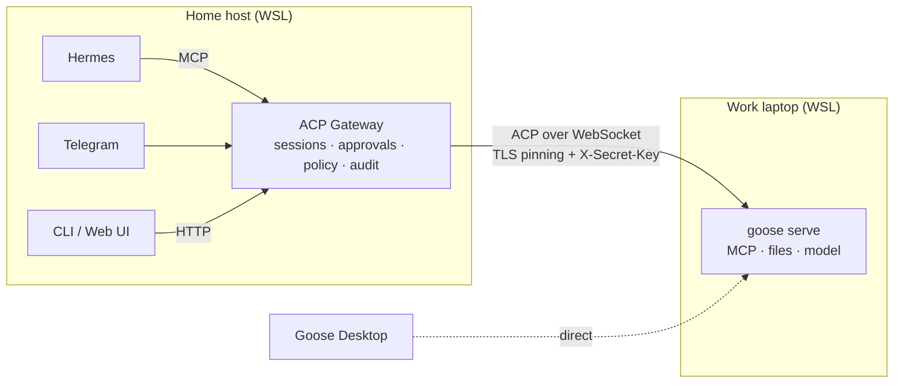

# ACP Gateway

[](LICENSE)


[](https://agentclientprotocol.com)

**ACP Gateway** is a local gateway that lets chat channels and other agents —
Hermes, Telegram, later XMPP, e-mail and a web UI — talk to a remote
[Agent Client Protocol](https://agentclientprotocol.com) agent such as
[goose](https://github.com/aaif-goose/goose). It delivers messages to the
agent and returns answers and tool-approval requests to the channels, with a
human in the loop for every risky action.

The first target is **Work Goose**: `goose serve` on a work laptop. Work MCP
servers, credentials, files and the model stay on that machine; the gateway
only knows the agent's address, a shared secret and the fingerprint of its TLS
certificate.



## Status

Early development. The foundation is done: the connection to a real goose
1.53.0 over the LAN is verified, along with sessions, approvals, cancellation
and session restore. The daemon and the channels do not exist yet. The plan
and the work queue are in [`road-map.md`](road-map.md) (in Russian).

| Area | State |
|---|---|
| Scaffold, config, secret redaction, pre-commit hook | ✅ |
| ACP over WebSocket with TLS pinning, verified on goose 1.53.0 | ✅ |
| Agent client (`acp_gateway.agents`) and recorded-traffic mock agent | ✅ `P1.1`, `P1.2` |
| Core: sessions in SQLite, jobs, event bus, channel contract | ✅ `P1.3` |
| Approvals: human routing, deadlines, audit; core policy limits | ✅ `P1.4` |
| Daemon, local API, approvals from the CLI | 🔜 `P1.5` |
| Hermes (MCP), then Telegram | 🔜 `P2` |
| Snikket/XMPP, e-mail, web UI | 🗓 `P4` |

## Principles

- **The agent executes, the gateway relays.** The gateway makes no decisions
  for the agent and stores no work MCP credentials.
- **A human approves.** Agent actions are approved in a channel with a live
  human (CLI, Telegram). LLM channels, Hermes included, never get an "allow"
  button. With no approver connected, the action is rejected.
- **Secure by default.** The local API listens on loopback only. Unencrypted
  transport to an agent is allowed only on loopback. The secret is sent only
  after the pinned certificate is verified. ACP client capabilities (`fs`,
  `terminal`) are disabled. Secrets are masked in logs and kept out of git.
- **Channels are thin adapters.** A new channel implements a shared contract
  and does not touch the core.

More in [`docs/architecture.md`](docs/architecture.md).

## Quick start

You need [uv](https://docs.astral.sh/uv/) and git; uv installs Python 3.12
itself. Linux/WSL is the primary platform; Windows and macOS are planned.

```bash
git clone git@github.com:Lujker/acp-gateway.git
cd acp-gateway
uv sync
```

### 1. Prepare the agent

On the agent machine, run `goose serve` with TLS and a secret and open the
port to the LAN. Step by step, including the Hyper-V firewall rule for WSL:
[`docs/setup/work-goose.md`](docs/setup/work-goose.md).

```bash
GOOSE_SERVER__SECRET_KEY='<long random secret>' \
goose serve --host 0.0.0.0 --port 3284 --tls
# note the GOOSED_CERT_FINGERPRINT=... line
```

### 2. Configure the gateway

```bash
cp config.example.yaml config.yaml      # agents, policy, logging
cp .env.example .env && chmod 600 .env  # secrets only
```

Set the agent address and certificate fingerprint in `config.yaml`:

```yaml
agents:
  - alias: work
    title: Work Goose
    kind: goose
    url: https://<agent-address>:3284   # /acp is appended automatically
    secret_env: AGENT_WORK_SECRET
    tls_fingerprint: "<GOOSED_CERT_FINGERPRINT>"   # empty = trust on first use
    default_cwd: /home/<user>
```

In `.env`: `AGENT_WORK_SECRET=<the same secret>`.

### 3. Check the connection

```bash
uv run acpgw config check                        # config is valid, secrets are present
uv run python scripts/spike_acp.py init          # TLS + ACP handshake
uv run python scripts/spike_acp.py ping          # a short request to the agent
```

The spike script has more scenarios: `modes`, `permission`, `cancel`, `load`,
`all`. Traffic is recorded to `spike-runs/` (git-ignored). The scenarios
`permission --permission allow` and `cancel` run harmless `echo` and `sleep`
commands on the agent machine.

## Configuration

| Source | Contents |
|---|---|
| `config.yaml` (`--config`, `ACPGW_CONFIG`, `./`, platform config dir) | structure: `gateway`, `agents`, `policy`, `logging` |
| `ACPGW_<SECTION>__<FIELD>` variables | overrides, e.g. `ACPGW_LOGGING__LEVEL=DEBUG` |
| `.env` (`--env-file`, `ACPGW_ENV_FILE`, `./`, config dir) | **secrets only**, referenced by name (`secret_env`) |

`uv run acpgw paths` shows the config, data and log directories on the
current platform.

## Development

```bash
uv sync                                  # environment and dependencies
git config core.hooksPath .githooks      # pre-commit: secret scan + ruff
uv run pytest                            # unit + integration tests
uv run ruff check && uv run ruff format --check
```

Integration tests start a mock goose (`tests/fakes/fake_goose.py`) whose
messages come from real goose 1.53.0 recordings in `tests/fixtures/acp/`; it
covers TLS, the secret, session modes, approvals, cancellation, session
loading and restarts. New recordings are cleaned with
`scripts/sanitize_fixture.py` before committing.

The development plan lives in [`road-map.md`](road-map.md) (statuses and
queue) and [`road-notes.md`](road-notes.md) (decisions and findings); both are
kept in Russian.

## Layout

```text
src/acp_gateway/   ACP client, core (jobs, approvals, policy), SQLite storage, config, cli
scripts/           spike_acp.py (agent check), check_secrets.py (hook), sanitize_fixture.py
tests/             unit, integration, fakes, fixtures/acp
docs/              architecture.md, setup/, archive/
```

## License

[MIT](LICENSE)
