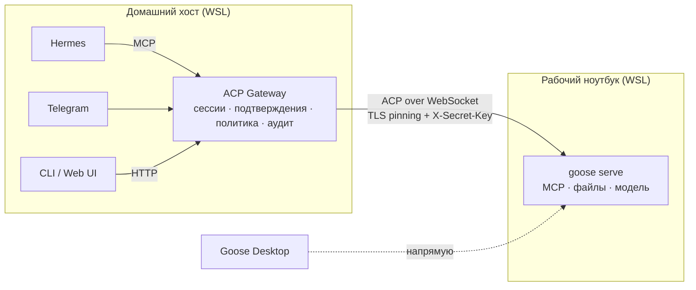

# ACP Gateway

[](LICENSE)


[](https://agentclientprotocol.com)

> A local gateway that lets chat channels and other agents (Hermes, Telegram,
> XMPP, e-mail, web) talk to a remote [ACP](https://agentclientprotocol.com)
> agent such as [goose](https://github.com/aaif-goose/goose) — with
> human-in-the-loop tool approvals, pinned TLS and no agent credentials leaving
> the agent's machine.

**ACP Gateway** — локальная шина между внешними каналами и ACP-агентом. Она
принимает сообщения из Hermes, Telegram, позже Snikket/XMPP, почты и Web UI,
доставляет их агенту по [Agent Client Protocol](https://agentclientprotocol.com)
и возвращает в каналы ответы и запросы подтверждения действий.

Первый целевой агент — **Work Goose**: `goose serve` на рабочем ноутбуке.
Рабочие MCP, credentials, файлы и модель остаются там; Gateway знает только
адрес агента, общий секрет и отпечаток его TLS-сертификата.



## Статус

Проект в ранней разработке. Готов фундамент: проверено подключение к
реальному goose 1.53.0 по LAN, а также сессии, подтверждения, отмена и
восстановление сессий. Демона и каналов пока нет. План и очередь работ —
[`road-map.md`](road-map.md).

| Что | Состояние |
|---|---|
| Каркас, конфиг, маскирование секретов, pre-commit-хук | ✅ |
| ACP по WebSocket с TLS-пиннингом, проверено на goose 1.53.0 | ✅ spike |
| Клиент агента, ядро (сессии, задачи, подтверждения) | 🔜 `P1` |
| Демон, локальный API, CLI-подтверждения | 🔜 `P1.5` |
| Hermes (MCP), затем Telegram | 🔜 `P2` |
| Snikket/XMPP, e-mail, Web UI | 🗓 `P4` |

## Принципы

- **Агент выполняет, Gateway передаёт.** Gateway не принимает решений за
  агента и не хранит рабочих MCP-credentials.
- **Подтверждает человек.** Действия агента подтверждаются в канале с живым
  человеком (CLI, Telegram). LLM-каналам, включая Hermes, кнопка «разрешить»
  не выдаётся. Если подтверждающего нет, действие отклоняется.
- **Безопасность по умолчанию.** Локальный API слушает только loopback.
  Нешифрованный транспорт разрешён только на loopback. Секрет уходит агенту
  лишь после проверки закреплённого сертификата. Возможности клиента ACP
  (`fs`, `terminal`) выключены. Секреты маскируются в логах и не попадают в
  git.
- **Каналы — тонкие адаптеры.** Новый канал реализует общий контракт и не
  трогает ядро.

Подробнее — [`docs/architecture.md`](docs/architecture.md).

## Быстрый старт

Нужны [uv](https://docs.astral.sh/uv/) и git; Python 3.12 uv поставит сам.
Основная платформа — Linux/WSL; Windows и macOS запланированы.

```bash
git clone git@github.com:Lujker/acp-gateway.git
cd acp-gateway
uv sync
```

### 1. Подготовить агента

На машине агента запустите `goose serve` с TLS и секретом и откройте порт в
LAN. Пошагово, включая правило Hyper-V firewall для WSL, —
[`docs/setup/work-goose.md`](docs/setup/work-goose.md).

```bash
GOOSE_SERVER__SECRET_KEY='<длинный случайный секрет>' \
goose serve --host 0.0.0.0 --port 3284 --tls
# запомните строку GOOSED_CERT_FINGERPRINT=...
```

### 2. Настроить Gateway

```bash
cp config.example.yaml config.yaml      # агенты, политика, логирование
cp .env.example .env && chmod 600 .env  # только секреты
```

В `config.yaml` укажите адрес агента и отпечаток сертификата:

```yaml
agents:
  - alias: work
    title: Work Goose
    kind: goose
    url: https://<адрес-агента>:3284    # /acp допишется сам
    secret_env: AGENT_WORK_SECRET
    tls_fingerprint: "<GOOSED_CERT_FINGERPRINT>"   # пусто — trust on first use
    default_cwd: /home/<user>
```

В `.env` — `AGENT_WORK_SECRET=<тот же секрет>`.

### 3. Проверить подключение

```bash
uv run acpgw config check                        # конфиг валиден, секреты на месте
uv run python scripts/spike_acp.py init          # TLS + рукопожатие ACP
uv run python scripts/spike_acp.py ping          # короткий запрос к агенту
```

У spike-скрипта есть и другие сценарии: `modes`, `permission`, `cancel`, `load`,
`all`. Трафик пишется в `spike-runs/` (каталог в `.gitignore`). Сценарии
`permission --permission allow` и `cancel` выполняют на машине агента
безвредные `echo` и `sleep`.

## Конфигурация

| Источник | Что содержит |
|---|---|
| `config.yaml` (`--config`, `ACPGW_CONFIG`, `./`, каталог конфига платформы) | структура: `gateway`, `agents`, `policy`, `logging` |
| переменные `ACPGW_<РАЗДЕЛ>__<ПОЛЕ>` | переопределения, например `ACPGW_LOGGING__LEVEL=DEBUG` |
| `.env` (`--env-file`, `ACPGW_ENV_FILE`, `./`, каталог конфига) | **только секреты**, на них ссылаются по имени (`secret_env`) |

`uv run acpgw paths` покажет каталоги конфига, данных и логов на текущей
платформе.

## Разработка

```bash
uv sync                                  # окружение и зависимости
git config core.hooksPath .githooks      # pre-commit: проверка секретов + ruff
uv run pytest                            # unit + интеграционные тесты
uv run ruff check && uv run ruff format --check
```

Интеграционные тесты поднимают фейковый goose (`tests/fakes/fake_goose.py`):
TLS, секрет, режимы, подтверждения, отмену, загрузку сессий. Реальный трафик
goose 1.53.0 записан в `tests/fixtures/acp/`.

План разработки ведётся в [`road-map.md`](road-map.md) (статусы и очередь) и
[`road-notes.md`](road-notes.md) (решения и находки).

## Структура

```text
src/acp_gateway/   код Gateway: config, log, paths, cli
scripts/           spike_acp.py (проверка агента), check_secrets.py (хук)
tests/             unit, integration, fakes, fixtures/acp
docs/              architecture.md, setup/, archive/
```

## Лицензия

[MIT](LICENSE)
