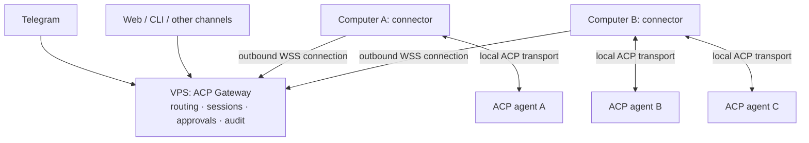

# ACP Gateway — target architecture

> Document status: the current target architecture, updated whenever a
> decision changes. The chronology of decisions and findings lives in
> [`road-notes.md`](../road-notes.md); statuses and the work queue live in
> [`road-map.md`](../road-map.md) (both kept in Russian).
> The original plan as it stood before the 2026-10-06 review (historical, in
> Russian): [`archive/2026-10-06-initial-plan.md`](archive/2026-10-06-initial-plan.md).

## 1. Goal

**ACP Gateway** is a local bus that accepts messages from external channels
(Hermes, Telegram, later Snikket/XMPP, e-mail, a web UI and others), delivers
them to an ACP-compatible agent, and routes answers, events and approval
requests back to the channels.

The gateway is not tied to a particular agent: it speaks ACP, and everything
agent-specific (how to connect, authentication, TLS, modes) lives in an
**agent profile** (section 4.1). The first and so far only target agent is
**Work Goose** (`goose serve` on a work laptop); the rest of this document
uses it as the main example.

The gateway is not a second AI agent: it makes no decisions on the agent's
behalf, stores no work MCP credentials and has no access to the work file
system.

Installation is part of the product goal (`P3.4`, owner decision 2026-10-08):
provide a standalone executable with the complete CLI, plus a supported
checkout installation and initial setup command. Configuration, credentials,
pins and SQLite data remain outside distributable artifacts and survive updates.
Clear help and service install/enable/disable/status commands form a separate
operational goal (`P3.5`), with platform-specific service adapters behind the CLI.
Linux/WSL is first; native Windows follows `P3.2`, macOS follows `P4.6`.

## 2. Roles

- **Agent (Work Goose) — execution plane.** The only component that sees work
  MCP servers, credentials, files and the model, and that executes commands.
- **Gateway — transport/control plane.** Transport, session mapping, channel
  authorization, policy, approvals, audit.
- **Channels — frontends.** Thin adapters on top of the gateway core.

Goose Desktop keeps connecting to Work Goose directly; the gateway neither
replaces it nor depends on it.

## 3. Deployment topologies

The current LAN and co-located topologies are followed by a planned VPS
dispatcher topology (`P4.1`, before channel extensions `P4.2`–`P4.4`). The connector is a launch
mode of the same program. Computer enrollment and a separate pinned WSS
registration/heartbeat channel are implemented. ACP task relay is next.

| Topology | Gateway runs on | Work Goose runs on | Transport | Status |
|---|---|---|---|---|
| **LAN** (initial default) | home host, WSL | work laptop, WSL | `wss://<work-host>:<port>/acp`, TLS + secret + pinning | MVP target |
| **Co-located** | the same machine as Work Goose | WSL | `ws://127.0.0.1:3284/acp` (loopback), secret | supported from MVP |
| **VPS dispatcher** | VPS with a stable IP and/or domain | multiple computers, any ACP-compatible agents | computers initiate WSS connections through our own connector | registration channel implemented; task relay next, `P4.1` |

Gateway platforms: **WSL (Linux) is the primary and recommended path**,
native Windows and macOS adapters are planned. Hence the code requirements:
plain Python without OS-specific dependencies in the core, paths via
`platformdirs`, service wrappers (systemd / Task Scheduler / launchd) as
separate files under `deploy/`.

The initial Linux/WSL service control is implemented in `service.py`, generating
a systemd user unit with absolute executable/config paths. `setup` creates
private configuration and independent owner/MCP tokens, preserving existing
files. `scripts/install.sh` installs the checkout as an isolated uv tool.
The Windows logon task under `deploy/windows/` keeps the WSL distro alive;
gateway autostart remains controlled by the systemd unit. Windows reboot
verification remains outstanding. A standalone Linux executable recipe now
bundles Python, dependencies, SQL migrations and version metadata through
PyInstaller; local builds emit versioned archives and SHA-256 checksums.
GitHub Actions is optional and manual only; releases are also manual.
The user D-Bus and real systemd lifecycle/crash recovery have been verified
for source and binary installations. See [binary installation](setup/binary.md).
See [installation and service control](setup/service.md).

### 3.1. Networking in the LAN topology

`goose serve` inside WSL sits behind NAT and is not reachable from the LAN by
default. On the work laptop this is solved in one of two ways (the choice is
recorded under `P0.1`):

1. **WSL mirrored networking** (`.wslconfig`: `networkingMode=mirrored`) plus
   an inbound Hyper-V firewall / Windows Firewall rule for the port — the
   primary option; the reference setup opens the port with a Hyper-V firewall
   rule (see [`setup/work-goose.md`](setup/work-goose.md));
2. `netsh interface portproxy` from Windows to the WSL IP plus a firewall
   rule — a fallback; the WSL IP changes on restart, so it needs a startup
   script.

Plus a stable address for the work laptop (a DHCP reservation or a LAN host
name). Corporate policy restrictions (GPO on the firewall and `.wslconfig`)
are checked under `P0.1`.

Outbound connections from the home WSL into the LAN work without any setup.

### 3.2. Planned VPS dispatcher and WSS connector

Updated priority, 2026-10-08: start the Linux/WSL connector before native
Windows, using the existing core/channels. Channel extensions `P4.2`–`P4.4`
follow this work. Use
our own connector, not Tailscale, VPN, SSH or frp tunnels.



WSS arrows show which side establishes the connection; requests, responses,
events and approvals travel in both directions. A computer needs no public
IP or inbound port forwarding. The connector (working command name:
`acpgw connector`) starts automatically, reconnects after network loss or
sleep, and retains its identity across restarts. Computer connectivity and
individual agent readiness are separate states.

One computer can expose multiple agents. Channels let users choose a
computer and agent while keeping their sessions and approval routing distinct.
Any ACP-compatible agent is a target, subject to its advertised capabilities
and supported transport. Goose and Hermes are validation candidates, not
required dependencies or an exhaustive agent list. Plan for local network ACP
connections and a stdio bridge.

Execution, work files, tools and their credentials remain on agent computers.
The VPS handles prompts, answers and approval data, so it is a trusted
dispatcher. Approvals remain human decisions; the connector does not grant
permissions on its own. Reconnecting a computer does not by itself guarantee
resuming an interrupted task or restoring a session.

The first target is one owner, Linux/WSL connectors and network ACP agents.
Development stages and the protocol boundary are documented in
[the connector design](items/connector.md). Multi-user access, stdio bridging
and native platform adapters follow the initial route.

## 4. ACP: how the protocol actually behaves

Confirmed by the `P0.2` spike against a real goose 1.53.0 over the LAN
(2026-10-06); recorded traffic is in `tests/fixtures/acp/goose-1.53.0/`,
details in `road-notes.md`.

We use the official Python SDK `agent-client-protocol` (`import acp`, 0.12.x):
schema, `ClientSideConnection`, `connect_to_agent`. The transport is
**WebSocket only, our own implementation** (`websockets` plus an SSL context
with pinning), because the SDK's `create_websocket_stream` does not accept an
SSL context. Streamable HTTP is not used: after `session/load` the response
never reaches the client (a hang with real goose, a 404 with the SDK reference
server), because the `session/load` result carries no `sessionId` to bind the
session-scoped stream to.

### 4.1. Agent profiles

An agent is described by a profile in `config.yaml` (`agents:` is a list; the
MVP has one profile). A profile sets the alias (`work`), the backend
transport, the address, authentication, TLS, `default_cwd` and agent-specific
settings.

| Backend | Connection | When | Status |
|---|---|---|---|
| `remote` (WebSocket) | the agent already listens on the network, like `goose serve` | Work Goose over LAN and co-located | MVP |
| `stdio` | the gateway spawns the agent as a process (`goose acp`, Gemini CLI, Claude Code / Codex adapters, Kiro…) | co-located only: the agent on the same machine | `P4.7`, CONDITIONAL |

Agents that expose only stdio need a local bridge for remote access. This is
outside the current remote backend and planned through the connector in
`P4.1`; the local stdio backend remains under `P4.7`.

Specifics of the `goose` profile (`remote` backend):

- `goose serve` exposes ACP at `/acp`; the default is `127.0.0.1:3284`, and
  `--host/--port` change it. Goose Desktop takes a base URL without a path, so
  the gateway appends `/acp` when the path is empty and treats `https://` as
  `wss://`;
- authentication is the `X-Secret-Key` header (`GOOSE_SERVER__SECRET_KEY`);
  the browser-oriented `?token=` variant is not used because it puts the
  secret into URLs and logs;
- `--tls` creates a self-signed certificate and prints
  `GOOSED_CERT_FINGERPRINT=...` — the SHA-256 of the certificate DER (it
  matched our own computation). Pinning: the certificate is read without
  sending credentials and compared with the pin; the real handshake then runs
  in an SSL context that trusts only that certificate, and only there is
  `X-Secret-Key` sent. Without a pin in the config: trust on first use, saved
  to `<data_dir>/pins/<alias>.sha256`;
- WebSocket redirects are refused: credentials and the TLS pin apply only to
  the configured endpoint;
- **new goose sessions start in `auto` mode** (no approvals); session modes
  are `auto`, `approve`, `smart_approve`, `chat`. Right after `session/new`
  and `session/load` the gateway sets the mode from the profile
  (`session/set_mode`) — see the table below;
- session `configOptions`: `provider`, `mode`, `model`, `thinking_effort` —
  potentially controllable from channels later;
- session ids look like `YYYYMMDD_N`; sessions are stored by goose and listed
  by `session/list` (`delete` and `close` exist too);
- a single prompt costs ≈25k input tokens as a baseline (goose system prompt
  and tools) — worth keeping in mind for frequent short requests.

Semantics the design must respect:

| Operation | How ACP does it | Consequence for the gateway |
|---|---|---|
| Agent reply | `prompt()` returns only `stopReason`; text and events arrive as `session/update` notifications (`agent_message_chunk`, `tool_call`, `tool_call_update`, `plan`, …) | streaming is the base mechanism from day one; the "final answer" is the collected chunks |
| Approval | the agent sends `tool_call`, then a **request** `session/request_permission` with options (`allow_always`, `allow_once`, `reject_once`, `reject_always`) and waits; goose sets `title` = `shell · <command>`, `rawInput` = `{command, timeout_secs}` | the Approval Manager holds the open RPC as a `Future`; a button in a channel completes it with the chosen `optionId`. Show the human `rawInput` — goose may rewrite the command (Work Goose adds an `rtk` prefix) |
| Cancel | a `session/cancel` **notification**; `prompt()` ends with `stopReason=cancelled` (goose: within 0.01–0.1 s at any stage — generation, waiting for approval, running a command) | every pending permission request of the session is answered `cancelled` |
| Restore | `session/load` (goose advertises `loadSession`) replays history as `session/update` (`user_message_chunk`, `agent_message_chunk`) before answering `session/load`; the model keeps its context | everything received before the `session/load` response is replayed history and is not forwarded to channels |
| New session | `session/new` requires `cwd` and `mcp_servers` | `cwd` is a path on the Work Goose machine (`default_cwd` in the config); `mcp_servers=[]` always |
| Approval mode | goose sessions start in `auto` — no permission requests at all | the profile sets `session_mode` (default `smart_approve` — owner decision 2026-10-06; `approve` on request); the gateway applies it with `session/set_mode` after `session/new`/`session/load`; if that fails, the session is not used |
| Other events | `usage_update`, `session_info_update` (session title, `activeRunId`), `available_commands_update` (goose slash commands and skills), `current_mode_update` | not forwarded to channels; `usage` goes to audit/status |

## 5. Components

```text
                 ┌────────────────── Gateway daemon (single process) ───────────────────┐
 Hermes ──MCP──▶ │ channels/mcp ─┐                                                      │
 Telegram ─────▶ │ channels/tg  ─┼─▶ core: sessions · turns · jobs · approvals · policy │──ACP──▶ agent (Work Goose)
 CLI / Web ─HTTP▶│ api (HTTP+SSE)┘          │                                           │
                 │                      storage (SQLite) · audit · event bus           │
                 └──────────────────────────────────────────────────────────────────────┘
```

- **`agents/` — AgentClient** (implemented in `P1.1`). One ACP connection per
  agent profile over our WebSocket transport (`transport.py`) with TLS pinning
  (`tls.py`), the `X-Secret-Key` header for goose (a bearer token for generic
  profiles) and `initialize` with every client capability disabled.
  `ensure_connected()` retries with backoff (1, 2, 5, 10, 30 s; auth and pin
  errors are not retried). `new_session()` / `load_session()` apply the
  profile's `session_mode`; a session not yet attached to the current
  connection (after a reconnect or in a new process) is loaded automatically
  with its saved working directory and its history replay dropped. Sessions
  become usable only after the mode is applied successfully.
  `prompt()` is an async stream of normalized events (`events.py`) that always
  ends with `TurnFinished`; closing it early
  cancels the turn; one running turn per session (`SessionBusy`).
  If the agent does not finish the prompt within five seconds after the stream
  is closed, the local request is cancelled and the session remains blocked
  (`SessionBusy`) until a fresh connection is established; late permission
  requests for that session are cancelled. Other sessions remain usable.
  Permission requests go to a caller-supplied async handler that returns an
  option id — the default rejects everything; `cancel()` answers pending requests
  `cancelled`. Errors are normalized (`errors.py`).
- **`core/` — GatewayCore** (sessions, jobs and the bus implemented in
  `P1.3`). An in-process service used by every channel; it owns the store and
  the agent clients:
  - *sessions* — a conversation `(channel, conversation_key, agent)` owns
    any number of agent sessions and points at the active one (`/new`,
    `/sessions`, switching); the first message of a conversation creates a
    session. An agent session belongs to exactly one conversation;
  - *jobs* — every prompt is a job: `submit → job` returns at once,
    `wait(job_id, timeout)` returns the finished job or its running snapshot
    (partial answer), `ask` = submit + wait; needed for the MCP channel and its
    timeouts. One running job per session; a new message to a busy session is
    refused with `SessionBusy` (a queue may come later if needed). Statuses:
    `running`, `completed`, `cancelled`, `failed` (agent error), `interrupted`
    (the gateway stopped). `cancel(conversation)` stops every running job of
    the conversation; if the agent does not end the turn within a grace
    period, the gateway stops waiting for it. The answer is stored, the prompt
    is not; finished jobs are pruned after 7 days;
  - *approvals* — implemented in `P1.4`; see section 6;
  - *policy* — implemented in `P1.4`; see section 7;
  - *event bus* — `SessionCreated`, `JobStarted`, `JobProgress` (raw agent
    events), `JobFinished`; subscribers filter by channel or conversation and
    have bounded queues (a slow subscriber loses events instead of stalling a
    turn).
- **`channels/` — the channel contract** (`base.py`) and adapters. A new
  channel implements the contract and does not touch the core: the core
  starts and stops registered channels, a channel calls the core directly and
  reads results from `wait` or the bus.
  **What a channel sees** (owner decision 2026-10-06): by default only the
  request and the agent's final answer, a short "working" status and — if the
  channel is an approver — approval requests. Intermediate `tool_call`, `plan`
  and agent reasoning are not forwarded to Telegram or Hermes; the detailed
  event stream is available through the local API's SSE (CLI, web UI).
- **`api/` — local HTTP API + SSE.** Used by the CLI, the web UI and
  third-party clients. Telegram and the MCP channel talk to the core directly,
  not over HTTP. Implemented in `P1.5`; bearer authentication, loopback Host
  checks and bounded request bodies apply before route handling. Job streams
  recover dropped events using authoritative snapshots. The owner token is
  distinct from MCP and agent credentials. See [the API contract](setup/gateway.md).
- **`cli/` — `acpgw`.** A client of the daemon's HTTP API (`status`,
  `sessions`, `new`, `switch`, `ask`, `result`, `stop`, `approvals`). `serve`
  composes the core from config and runs the API; a file lock protects each
  data directory from a second daemon. Direct agent debugging remains in
  `scripts/spike_acp.py`.
- **`storage/`** — SQLite through the standard `sqlite3` module, used
  synchronously from the event loop (each statement touches a few rows of a
  local file; no ORM, no `aiosqlite`): `sessions`, `conversations`, `jobs`,
  `approvals_audit`; numbered SQL migrations tracked by `PRAGMA user_version`.
  The database is `<data_dir>/gateway.db`, readable only by its owner. On POSIX,
  opening an existing database also enforces mode `600` on it and its existing
  WAL/SHM files.

## 6. Approvals

Implemented in `core/approvals.py`. `GatewayCore` installs its permission
handler through `AgentClient.set_permission_handler()` when it takes ownership
of the clients. A handler cannot be replaced during a running turn.

An approval belongs to a job, an agent and its ACP session. It stays in memory
as a Future until a human decision, timeout, cancellation or shutdown settles
it. The first decision wins. Timeout and missing approvers choose `reject_once`
when offered by the agent, otherwise `cancelled`. Automatic rejection reasons
are included in the resulting job's `error` field alongside the agent's answer.

Human adapters opt in with `Channel.can_approve=True`, appear in the policy's
`approver_channels`, and report an actually reachable human via `connected`.
They receive events through `for_approver(name)` and can recover the pending
list with `core.pending_approvals(name)`. Each recipient receives only its
permitted options. `core.resolve_approval(id, option_id, channel=..., actor=...)`
checks eligibility, routing, the option and the monotonic deadline. Adapters
authenticate the human and supply that identity; the core is an in-process
service, not an authentication endpoint. MCP/Hermes cannot be approvers even
if accidentally allowlisted. The CLI channel is implemented in `P1.5`:
an authenticated approval watcher holds a server-issued lease for the
lifetime of its SSE connection. A daemon without a watcher has no connected
CLI human. Decisions require a live lease; the API supplies the authenticated
`local-api-owner` actor rather than trusting client input.

Settled decisions are written to SQLite `approvals_audit` before an allow
response can reach the agent. Audit failures fail closed. The audit includes
the originating conversation, job, tool and arguments, timestamps, outcome,
deciding channel and human identity. Registered secrets and sensitive keys are
masked in stored titles and arguments. Decisions survive restart and job
retention cleanup; pending requests are never restored.

- Nothing is approved automatically by default; an expired request becomes
  `reject`/`cancelled`.
- An approval request goes to an **approver channel** — a channel with a live
  human — which is not necessarily the channel the prompt came from. A task
  started from Hermes is approved by a human in the CLI/Telegram, not by the
  Hermes model.
- The MCP channel **never** exports approve/deny tools: otherwise an LLM agent
  could approve its own actions.
- `allow_always` from remote channels is forbidden by policy; `allow_once` /
  `reject_once` are available. Local CLI may use `allow_always` only when
  `allow_always_approval` is explicitly enabled; the default forbids it.
- If no approver channel is connected, the request is rejected immediately
  with a clear message to the originating channel.
- Every decision is written to `approvals_audit`: who, when, through which
  channel, tool, arguments (secrets masked), outcome.
- Pending approvals are lost when the gateway restarts — deliberately: the
  agent rejects them together with the dropped connection.

## 7. Security

Invariants (covered by tests):

1. In `initialize` the gateway advertises **all client capabilities as
   disabled** (`fs.readTextFile`, `fs.writeTextFile`, `terminal`) — the agent
   cannot ask the gateway host to read/write files or run commands.
2. `session/new` is always sent with `mcp_servers=[]`.
3. Secrets (agent secret, bot and API tokens) never reach the logs — a
   redacting filter in the logger plus tests.
4. The API and the MCP endpoint listen on `127.0.0.1` only and require a
   bearer token.
5. Channels work with an allowlist of identities (Telegram user_id, JID,
   e-mail); there is no "allow all".

What the gateway stores: agent addresses and secrets, fingerprints, channel
tokens (in `.env` with mode `600`; an OS keyring later), session ids, audit
metadata. What it does not store: corporate MCP credentials, API keys,
cookies, SSH keys.

Policy (`config.yaml`):

```yaml
policy:
  allow_new_sessions: true
  allow_cancel: true
  allow_approvals: true
  allow_always_approval: false
  allow_file_upload: false
  allow_file_download: false
  max_prompt_length: 50000
  max_response_length: 100000
  approval_timeout_seconds: 300
  approver_channels: [cli, telegram]
```

The core receives `PolicySettings` via its `policy=` constructor argument.
Prompt length is checked before session creation. `allow_new_sessions` applies
to explicit `/new` and first-message creation; existing sessions remain usable.
`allow_cancel` governs user cancellation, while shutdown and safety cleanup
always cancel work. Response length is enforced across streamed chunks: the
stored and published answer is capped, the turn is closed and the job fails
with a policy error if it exceeds the limit. Upload/download checks are ready
for future file adapters; file transfer itself remains out of scope.

Later: a tool allowlist, a shell pattern denylist, per-channel permissions.

Accepted risks and data boundaries:

- **Telegram** offers no end-to-end encryption for bots: everything the agent
  answers in Telegram passes through Telegram's servers. The owner accepted
  this risk without restrictions (2026-10-06).
- **Hermes** has persistent memory: agent answers that pass through Hermes may
  settle in its memory. The home/work boundary holds at the session level but
  not at the level of Hermes memory; the owner accepted this risk
  (2026-10-06).

## 8. Configuration

Implemented in `P0.3` (`src/acp_gateway/config.py`); full examples:
[`config.example.yaml`](../config.example.yaml) and
[`.env.example`](../.env.example).

- **`config.yaml`** holds the whole structure: `gateway`, `agents`, `policy`,
  `logging`. Lookup: `--config` / `ACPGW_CONFIG` → `./config.yaml` → the
  platform config directory.
- **Environment variables** `ACPGW_<SECTION>__<FIELD>` override `config.yaml`
  (`ACPGW_LOGGING__LEVEL=DEBUG`).
- **`.env` holds secrets only.** Profiles and the `gateway` section refer to a
  variable by name (`secret_env`, `api_token_env`, `mcp_token_env`); the value
  comes from the process environment first, then from `.env`. Lookup:
  `--env-file` / `ACPGW_ENV_FILE` → `./.env` → the config directory. Settings
  cannot be overridden through `.env` — on purpose, so secrets and parameters
  never mix in one file.
- On load, every referenced secret is registered with the log redactor.

Load-time checks (invariants): `gateway.host` must be loopback; `ws://` /
`http://` to an agent only on loopback, otherwise an explicit
`allow_insecure_transport: true` is required; `tls_fingerprint` must be a
SHA-256 and only with `wss://`/`https://`; agent aliases are unique; unknown
keys are errors.

Profile fragment:

```yaml
agents:
  - alias: work                  # MCP tool prefix and the name shown in channels
    title: Work Goose
    kind: goose                  # agent-specific profile logic
    backend: remote
    url: wss://work-laptop.lan:3000/acp   # co-located: ws://127.0.0.1:3284/acp
    secret_env: AGENT_WORK_SECRET
    tls_fingerprint: ""          # empty → trust on first use
    default_cwd: /home/<user>/work
```

Data (SQLite, logs) lives in the platform directories (`platformdirs`,
`acpgw paths`).

## 9. Errors

Normalized errors: `AgentUnavailable`, `AuthenticationFailed`,
`TLSFingerprintMismatch`, `TransportDisconnected`, `SessionNotFound`,
`SessionBusy`, `PromptFailed`, `ApprovalTimeout`, `PolicyDenied`,
`RateLimited`. Each channel turns them into its own readable text using the
agent name from the profile ("Work Goose is unavailable right now").

## 10. Stack

Python 3.12+, `uv`, `agent-client-protocol` (`acp`), FastAPI + uvicorn, the
MCP Python SDK (FastMCP, Streamable HTTP) for the MCP channel, aiogram 3 for
Telegram (HTML parse mode), `sqlite3`, `pydantic` /
`pydantic-settings`, `structlog`, `platformdirs`, `pytest` + `pytest-asyncio`,
`ruff`.

## 11. Repository layout

```text
acp-gateway/
├── road-map.md · road-notes.md · README.md
├── pyproject.toml · .env.example · config.example.yaml
├── src/acp_gateway/
│   ├── config.py · log.py · paths.py · daemon.py
│   ├── agents/     client.py · transport.py · tls.py · events.py · errors.py
│   ├── core/       gateway.py · bus.py · errors.py · (approvals.py · policy.py — P1.4)
│   ├── storage/    db.py · records.py · migrations/
│   ├── channels/   base.py · mcp/ · telegram/ · (xmpp/ · email/ later)
│   ├── api/        app.py · routes_*.py · schemas.py
│   └── cli/        main.py
├── tests/          unit/ · integration/ · e2e/ · fakes/ · fixtures/acp/
├── scripts/        check_secrets.py · spike_acp.py · sanitize_fixture.py
├── .githooks/      pre-commit
├── deploy/         systemd/ · windows/ · macos/
└── docs/           architecture.md · setup/ · archive/
```

Test bench (`P1.2`): `tests/fakes/fake_goose.py` is a mock goose built on the
SDK's agent side and served by uvicorn; every payload it sends (initialize
result, modes and config options, `tool_call` / `request_permission` /
`tool_call_update`, turn usage and session info updates) is taken from real
goose 1.53.0 recordings in `tests/fixtures/acp/` via `tests/fakes/recordings.py`.
`tests/unit/test_recorded_contract.py` checks that every recorded agent
message parses with the SDK schema and maps to a known gateway event.
Recordings are cleaned with `scripts/sanitize_fixture.py` before committing.
